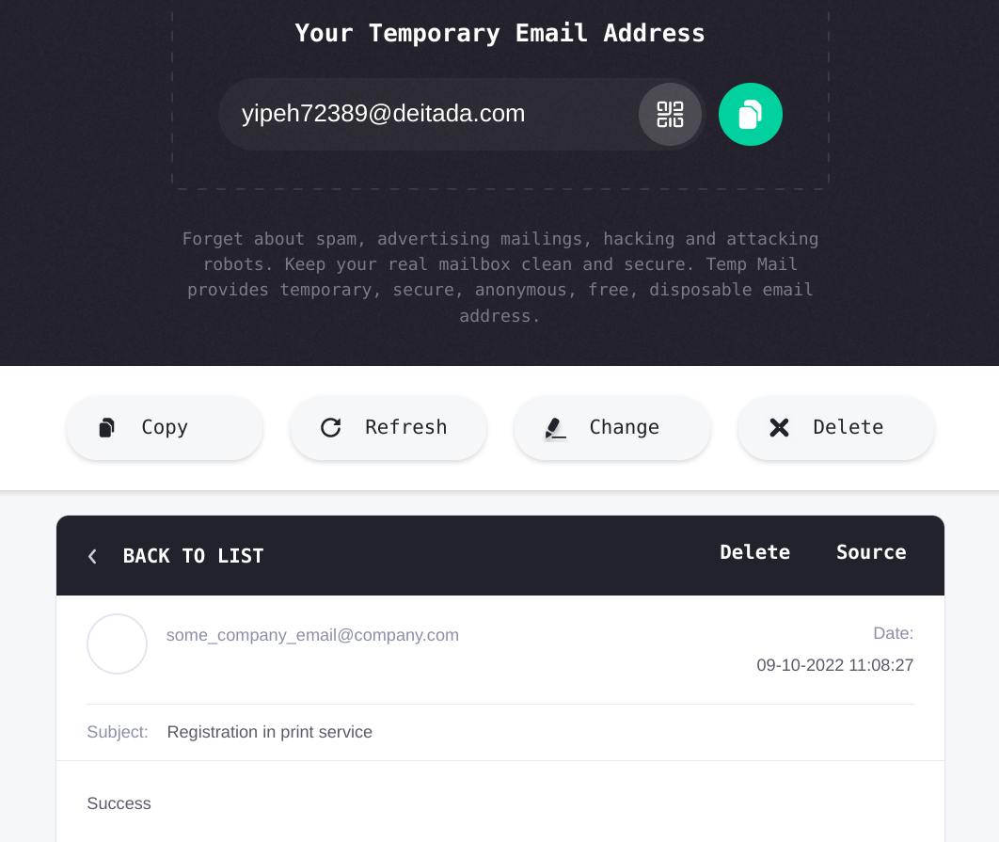

# Bot for registering users in the company's print service

A Telegram bot that allows you to sign up users to **Company X's** printer services by sending an email
from the printer vendor's mail server.

User registration information is recorded in the database.


<br>


## Run

1. Set the values of the required properties in [`applicaiton.properties`](src/main/resources/application.properties)
   , [`mail.properties`](src/main/resources/mail.properties).
2. Initialize the database structure by running [`init.sql`](src/main/resources/db/init.sql).
3. Create an archive:
   ```bash.
   $ mvn package
   ```
4. Run the archive:
    ```bash.
   $ java -jar target/print-service-register-bot-1.0-SNAPSHOT-jar-with-dependencies.jar
   ```

## Stack

- Java 17.
- Maven.
- PostgreSQL.
- Sping (context, data-jdbc).
- Lombok.
- Commons-validator.
- telegrambots.
- javaxmail.
